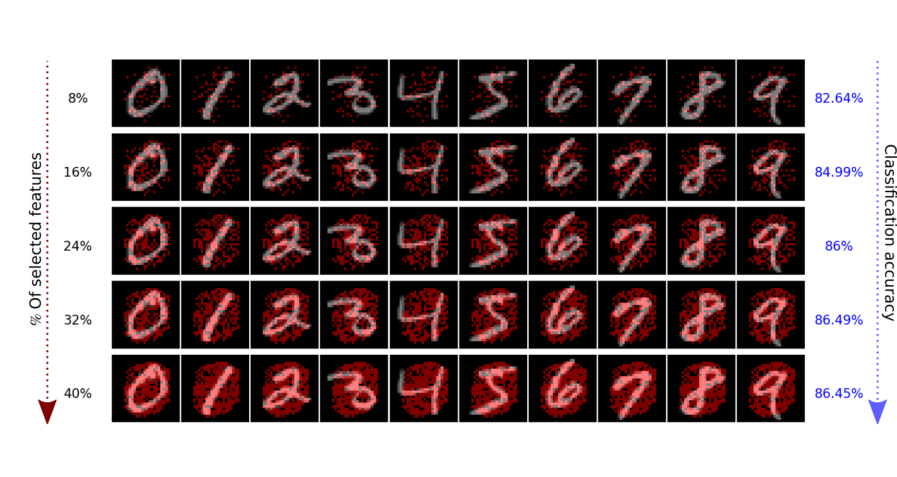
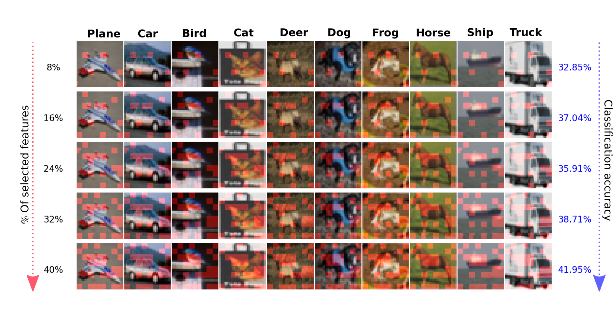

## Neural Greedy Pursuit (NGP)

NGP is a greedy algorithm which selects `N` important features among `P` input features. NGP is efficient in selecting `N` features when `N << P`, and it provides a notion of feature importance in a descending order following the sequential selection procedure.

<p align="center">
  
  </p>

<p align="center">
  
  </p>

### Installation

NGP can be added to any learning algorithm with basic understanding of the algorithm with few lines of code. Moreover, to compare the performance of NGP please install the necessary dependencies in [requirement.txt](requirement.txt) file. You also need to download the necessary datasets as mentioned in the paper for running the evaluation algorithm. A short description of each of the key functions of NGP is written in the beggining of the function itself. Look up into NMP.py for more details.

### Running

To run NGP on different datasets please use the following command:

```
python NGP.py --data=MNIST
```

To compare the performance of NGP wrt to the other classical feature selection methods use the following command:

```
python compare.py --data=ARTIFICIAL --algo=BART --tree_size=30
```

To try out different options for the compare algorithm you can try different options mentioned below.

* `data`: AIRFOIL, BOSTON, MNIST, CIFAR.
* `algo`: RF, BART, LASSO, GAM.
* `tree_size`: For BART and RF different tree size(s) are possible.
* `MC_Num`: The no of Monte Carlo simulations.
* `deeplift_sample_size`: For evaluating SHAP on the DeepLift local features you can limit the samples on which SHAP works for faster execution.
